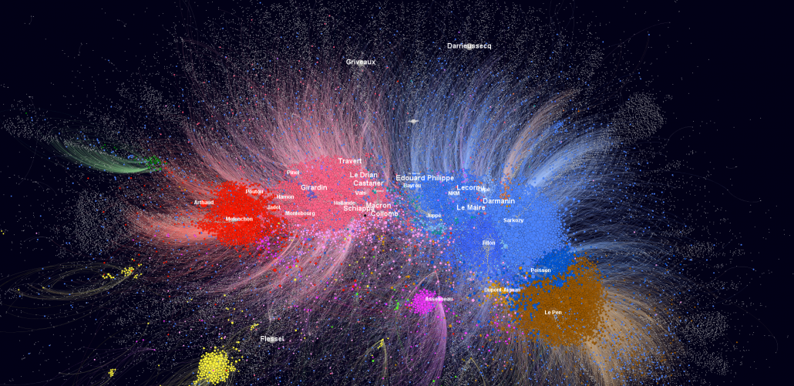

**Social Network Analysis**, EUI, Florence (2019)

&nbsp;

### Course Description

To prevent obesity or smoking initiation among teenagers, who should be targeted in an intervention? How can we contain the spread of an infectious disease under limited resources? Who should be vaccinated first in order to be most effective during vaccination shortages? How can we dismantle a terrorist organization, a drug distribution network or disrupt the communication flow of a criminal gang?

Social network analysis offers the theoretical framework and the appropriate methodology to answer questions like these by focusing on the relationships between and among social entities. Unlike transitional research methods, we shift the object of study from the individual as the unit of analysis, to the social relations that connect these individuals. A network is therefore a structure composed of units and the relationships that connect them. Network analysis is about the position of these units, the overall structure and how these affect the flow of information.

The focus of the course is not so much on how to express these concepts formally through mathematics, but rather on how to use appropriate software to acquire measurements for these concepts in the data and use them rigorously in empirical hypothesis testing. The majority of the course will focus on descriptive methods of network analysis, but we will also discuss network-specific models and inferential methods for network analysis.

**Objectives**

- Cover main topics on social network analysis research;
- Discuss data collection and appropriate structure for analysis, along with potential limitations;
- Explain and make predictions about political phenomena using the network analysis paradigm;
- Understand how to operate social network analysis software independently;
- Understand how to analyse results;
- Read published applications of network analysis;
- Broaden expertise on several topics independently;

### Course Structure

  - **Day 1 - Mathematical foundations, Centrality, Transitivity, Clustering**: 
    - [slides](eui2019/day1.html), [R materials](eui2019/day1lab.zip)
  - **Day 2 - Social capital, brokerage and equivalences  **: 
    - [slides](eui2019/day2.html), [R materials](eui2019/day2lab.zip)
  - **Day 3 - Cohesion, hypothesis testing & inferential networks**: 
    - [slides](eui2019/day3.html), [R materials](eui2019/day3lab.zip)
  
  - **Assessment**:
    - [instructions](eui2019/Instructions.docx), [R script](eui2019/final_assessment.R)

