# `r kableExtra::text_spec("Disclaimer!!", color = "red")`

```{r, out.width="90%",fig.align='center', echo=FALSE}

```


---
# Background

---
class: center, inverse
background-image: url("supranet_t.png")
background-position: center
background-size: contain

---

class: center
background-image: url("advance.png")
background-position: center
background-size: contain

---

class: center
background-image: url("dodd_frank2010.png")
background-position: center
background-size: contain


---
# Networks in Economics: the beginning

- emerged in a structured way in the 1990s;

- until then, Economics concerned either with interaction in small groups (micro/game theory) or in among large groups (general equilibrium models);

- lots of interesting phenomena lies in between these two extremes: e.g. learning new information, diffusion & adoption of technology.

- however, sociologists (Coleman & Granovetter) and political scientists (Lazarsfeld & Berelson) were already theorizing about how the intermediate layer was affecting behaviour and individual outcomes

- early papers by Goyal (1998) and Fudenberg (1993) formalized a framework where individuals learn and interact within groups: 
  - first models incorporate individual choice + network structure, focusing on behaviour in existing networks and on network formation;
  
- since then, it has grown both in terms of theoretical models, questions asked, empirical applications used and type of data analysed.

---
# characterizing the State of the Art...

- retrieve all publications in "Business & Economics" from Web of Science (N=38972);

- build co-citation network of papers referenced in those 38,972 articles

```{r, out.width="80%",fig.align='center', echo=FALSE}
knitr::include_graphics("trump.gif")
```

---

# ...in the age of **Huge Information**

- co-occurrence sparse, valued matrix with $\sim 462,540,090,609$ elements.

```{r, out.width="90%",fig.align='center', echo=FALSE}

```

---
# How else can we characterize this data?

-- Ugander et al. use a Hadoop cluster with 2,250 machines & reservoir sampling to arrive at a sample of 500,000 users on which analysis was performed, a far cry from the 721 million active facebook users in their data.

- **thinning** the network with an arbitrary threshold (citation count > 20);


---

class: center
background-image: url("cocitation2.png")
background-position: center
background-size: contain


---
# Two Approaches

1. Topic-Modeling with hierarchical stochastic blockmodels (Gerlach, Peixoto & Altmann 2018): a networks approach to topic modelling  <br />

2. Word Embeddings: an application of the keywords2vec model

---
# 1. Topic Modelling with Stochastic Block Models

- *blockmodelling*: divide the nodes of the network into distinct sets, or "blocks", where all nodes in the same block have the same pattern of connection to nodes in other blocks (a distinctive feature vis a vis other methods that focus on density.)

- **stochastic** *blockmodelling* weakens this idea: the probability of an edge between two nodes just depends on which blocks they are in, and is independent across edges;

- the observed network is seen as a random realisation from a sample space of all possible networks, and community structure is seen as a collection of blocks; 

- all nodes in a given block share the same probabilities of connection with other nodes in the network. Knwon as **stochastic equivalence** 

---

```{r, out.width="90%",fig.align='center', echo=FALSE}
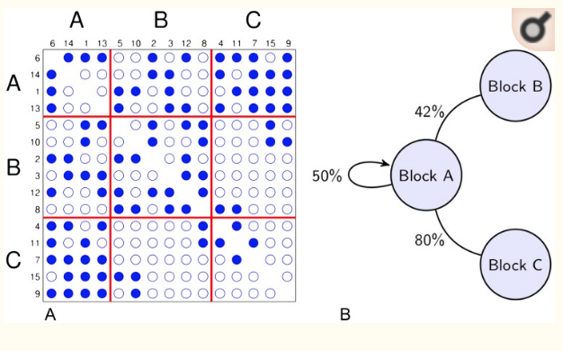
```

---
# Leveraging this approach to handle *text-as-data*

```{r, out.width="80%",fig.align='center', echo=FALSE}
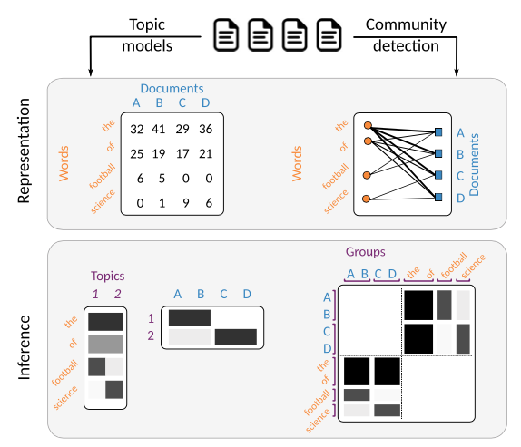
```

---
# Inference with vanilla LDA

- Drawing artificial documents with Latent Dirichlet Allocation

- For each topic $r= 1,...,K:$

  - Draw the word-topic distribution $\phi_w^{r}$ (frequencies of words conditioned on the topic $r$) from a V-dimensional Dirichlet:
  
  $$\phi_w^{r} \sim Dir_V(\beta_{wr})$$

- For each document $d= 1,...,D$:

  - Draw the topic-document distribution $\theta^r_d$ (frequencies of topics conditioned on the doc $d$) from a K-dimensional Dirichlet:
  $$\theta^r_d \sim Dir_K(\alpha_{dr})$$ 

– For each token $i_d= 1,...,n_d$ ($n_d$ is the length of each document) in document $d$:
  - Draw a topic $r_{id}$ from the categorical $\theta^r_d$
  - Draw a word-type $w_{id}$ from the categorical $\phi_w^{r_id}$

---

### Inference with LDA in 3 steps:

1. Draw document's attention to the topics; (1)

2. Conditional on (1), draw topic k for each word

3. Conditional on (2), draw word from unigram model of the topic k

---
# Inference with SBM

- texts as a network;

- nodes consist of documents and words; 

- strength of the edge between them is given by the number of occurrences of the word in the document; 

- yielding a bipartite multigraph.

- allows overlapping SBN with one layer in hierarchy; 

---
# Topic Modelling with Hierarchical Stochastic Block Models 

- LDA unable to infer non-LDA topic mixtures (middle panel)

- Dirichlet prior is a simplistic, noninformative assumption about the data-generating process: every mixture in the model (topics2document as well words2topics) is assumed to be equally likely, precluding any form of higher-order structure.

- limitation of Dirichlet prior: distribution is unimodal, meaning that it generates mixtures that are either concentrated around the mean value or spread away uniformly from it toward **pure** components.

```{r, out.width="75%",fig.align='center', echo=FALSE}
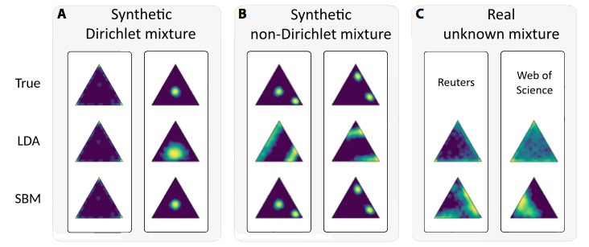
```


---
# HSBM-TM

```{r, out.width="70%",fig.align='center', echo=FALSE}
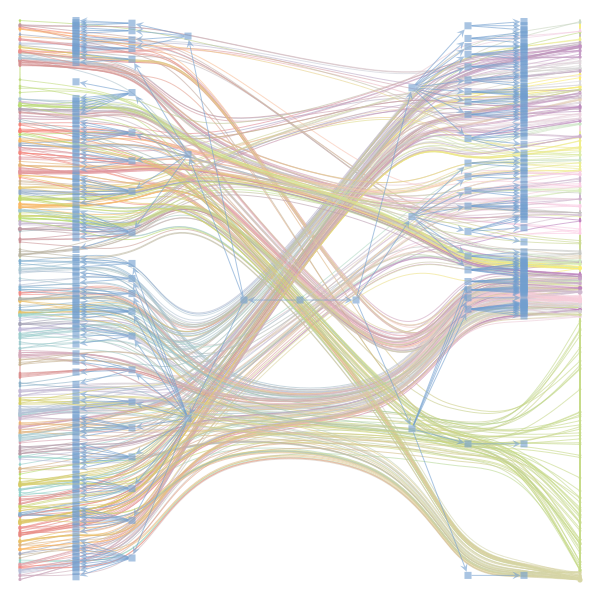
```

---
# Results 1990s

```{r, out.width="100%",fig.align='center', echo=FALSE}
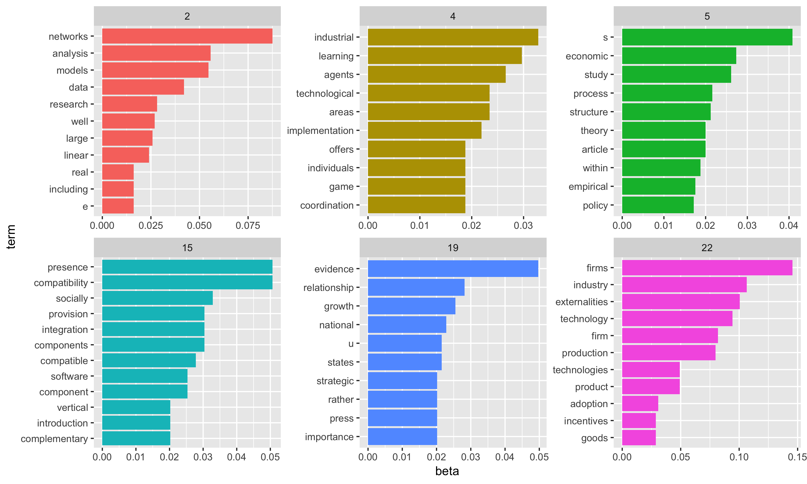
```

---
# Results 2010s

```{r, out.width="100%",fig.align='center', echo=FALSE}
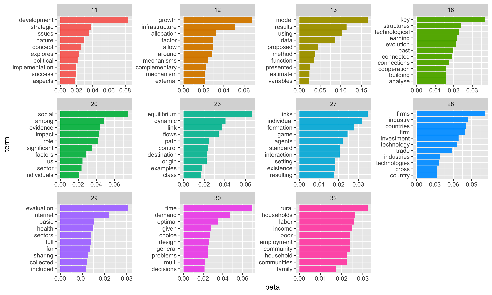
```


---
# 2. Word embeddings: keywords2vec (Pérez Rada)

- Modern neural word embedding models estimate a low-dimensional representation of a  word  as  a  dense  vector  by  either  factorizing  a word  co-occurrence matrix  or  predicting  the  co- occurrence of a pair of words using a single-layer neural network.

- Intuition: *distributional hypothesis*, “you shall know a word by the company it keeps” or “words that occur in similar context tend to have similar meaning”;
- they maximise the likelihood of the context given the focus word using cosine similarity to calculate vector similarities;

---
# Tokenizing the corpus: tokens vs chunks

**input**: "Timing of replacement therapy for acute renal failure after cardiac surgery"  <br />

**word2vec** output: ["timing", "of", "replacement", "therapy", "for", "acute", "renal", "failure", "after", "cardiac", "surgery"]  <br />

*vs*  <br />

**keywords2vec**: ["timing", "replacement therapy", "acute renal failure", "cardiac surgery"]  <br />


```{r, out.width="100%",fig.align='left', echo=FALSE}
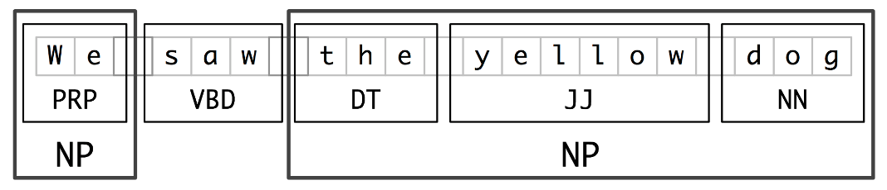
```

---
# keywords2vec

```{r, out.width="100%",fig.align='left', echo=FALSE}

```

---
# The semantic context of "networks" in the economics literature

```{r, out.width="80%",fig.align='center', echo=FALSE}
knitr::include_graphics("keywords2vec9010.png")
```

---
# A paradigm change

- macroeconomic volatility & cycles;
- patterns of international trade;
- contagion and risk in financial markets;
- resilience of infrastructure & supply chains;
- economic development;
- unemployment;
- inequality;

- field experiments...

---

# Field Experiments

**Field**: real people, real meaningful outcomes;

---

Three questions we try to answer about networks using field experiments:  <br />

1. **Peer effects**: does ***j*** influence the behaviour/outcomes if ***i***  <br />

2. **Network Formation**: what affects whether ***i*** forms a network tie with ***j***  <br />

3. **Designing networks**: which network structures maximise network-level outcomes? how do I design communication patterns in one group to maximize learning? how do I distribute information in a network, conditional on structure, such that everyone gets that information as fast as possible;

---
# 1. Peer Effects

Manski early 90s seminal paper: we cannot trust estimates of social influence models; why?

---

```{r, out.width="100%",fig.align='left', echo=FALSE}
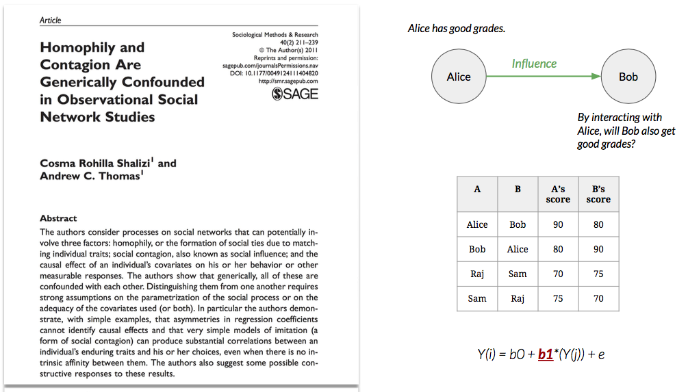
```

---

1. **Reflection**: The regression specifies the influence of A on B.    <br /> 
*We are picking up the influence of B on A.*

---

1. **Reflection**: The regression specifies the influence of A on B.    <br /> 
`r kableExtra::text_spec("**Lag the independent variable**", color = "green")`

---

1. **Reflection**: The regression specifies the influence of A on B.  <br />
*We are picking up the influence of B on A.*

2. **Selection**: Similar people are more likely to interact.    <br /> 
*We are picking up homophily, not influence.*

---

1. **Reflection**: The regression specifies the influence of A on B.  <br />
*We are picking up the influence of B on A.*

2. **Selection**: Similar people are more likely to interact.    <br /> 
`r kableExtra::text_spec("**Include controls that account for dimensions on which people may decide to form a connection.**", color = "green")`


---

1. **Reflection**: The regression specifies the influence of A on B.  <br />
*We are picking up the influence of B on A.*

2. **Selection**: Similar people are more likely to interact.    <br /> 
*We are picking up homophily, not influence.*

3. **Common shocks**: People who are interacting have common contexts and experiences.    <br /> 
*We are picking up the effect of common experiences.*

---
1. **Reflection**: The regression specifies the influence of A on B.  <br />
*We are picking up the influence of B on A.*

2. **Selection**: Similar people are more likely to interact.    <br /> 
*We are picking up homophily, not influence.*

3. **Common shocks**: People who are interacting have common contexts and experiences.    <br /> 
`r kableExtra::text_spec("**Include features of the context that may influence the performance of both A and B.**", color = "green")`

---

1. **Reflection**: The regression specifies the influence of A on B.  <br />
*We are picking up the influence of B on A.*

2. **Selection**: Similar people are more likely to interact.    <br /> 
*We are picking up homophily, not influence.*

3. **Common shocks**: People who are interacting have common contexts and experiences.    <br /> 
*We are picking up the effect of common experiences.*    <br /> 

    <br /> 

Why **randomization**?:    <br /> 

(1) **imbalance between treatment and control groups**

---

1. **Reflection**: The regression specifies the influence of A on B.  <br />
*We are picking up the influence of B on A.*

2. **Selection**: Similar people are more likely to interact.    <br /> 
*We are picking up homophily, not influence.*

3. **Common shocks**: People who are interacting have common contexts and experiences.    <br /> 
*We are picking up the effect of common experiences.*    <br /> 

    <br /> 

Why **randomization**?:    <br /> 

(1) **imbalance between treatment and control groups**    <br /> 

(2) **identification problem** (how much of $\beta$ is peer influence?)

---

# Sacerdote (2001)

```{r, out.width="100%",fig.align='left', echo=FALSE}
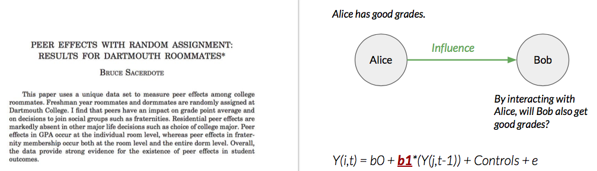
```

- First paper to open the door to network field experiments after Manski's theoretical argument in the 1990s;
- Information on Darthmouth students cohort who, required to sleep on campus in year 1, were randomly assigned to roomates.
- Tests whether there are causal social influence effects on grades: year 1 GPA as function of randomly assigned roomates highschool SATs;
- **Finding**: _no effect_ on academic performance;

---

+ Following 10 years saw a whole industry of peer-effects literature, following similar cases of roomate randomization;
+ Findings: all over the place.
+ However, Economics weren't thinking about networks; they conceived peer-randomization into roomates as an instrument.
+ These studies were not looking at the relationships people formed.

---
# Hasan & Bagde ASR (2003)

- Using data from an engineering college in India, they find large peer effects. However:
- only students who said they studied together revealed strong peer effects: without the network tie there were no peer-effects;
- learning was narrow and conditional on matching skills;
- Punchline: randomization isn't enough; **networks matter**

---
# Bond et al. *Science* (2012)

- sent messages to users encouraging turnout, checked if voted and whether their facebook friends also voted;
- finds strong ties dictated spread of online behaviour: peer-influence can spread over network, but nature of ties matters.

```{r, out.width="90%",fig.align='left', echo=FALSE}
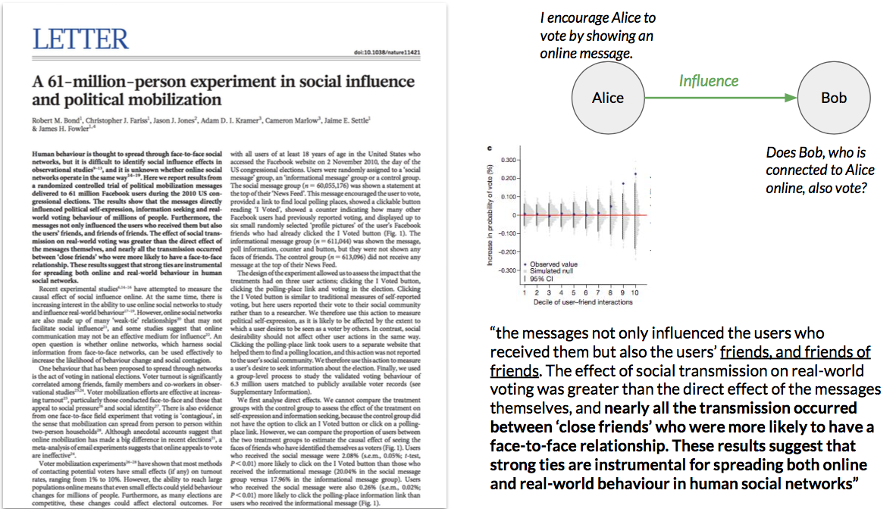 
```

---

#Bapna & Umyarov *Management Science* (2015)

- on **lastfm** encouraged user to buy product; do their friends also bought it?
- found strong spillover effects over strong ties;

```{r, out.width="100%",fig.align='center', echo=FALSE}
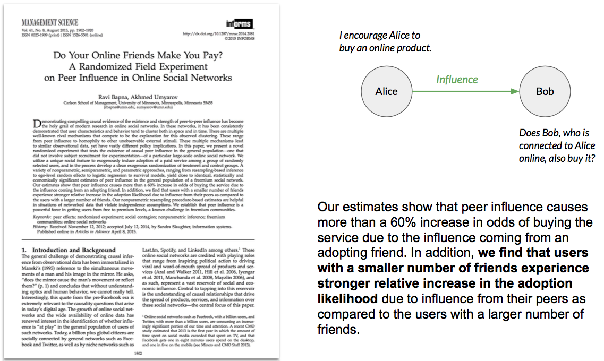
```
<br /> 

---
# 2. Network Formation

- what makes someone want to connect with someone else?

---

# Boudreau et al. (2017) *RESTAT*

- Harvard Catalyst (umbrella org tries to create interdisciplinary research and commercialize scientific research) conducted experimemt;
- got Harvard professors to present their research to their peers at an event; a a year later, the people who ended up forming a tie (getting grant together) weren't researchers from different fields, but rather researchers from same department who had never previously interacted;

```{r, out.width="80%",fig.align='center', echo=FALSE}
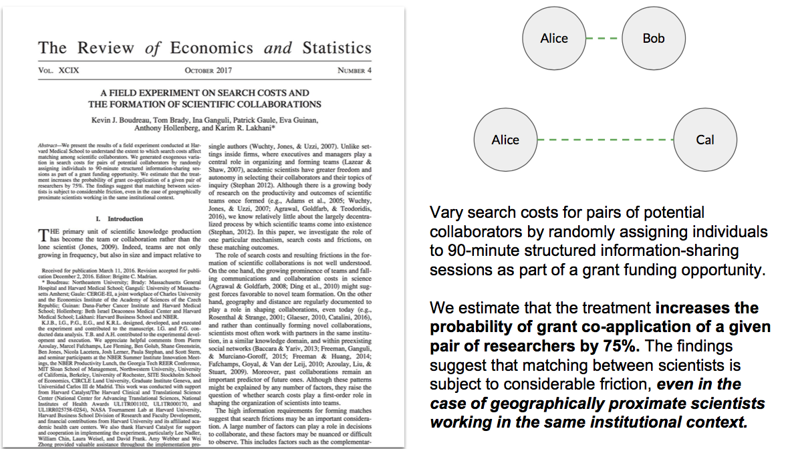
```

---
# 3. Designing Networks

- which network level structures maximize a network level outcome?


---
# Centola (2010) *Science*

- looks at diffusion of health behaviour in artificial networks online
- finding: networks that are highly clustered have higher diffusion compared to random networks;
- mechanism: nodes are hit with information coming from different places in the network; in random networks, ties are diffuse;

```{r, out.width="100%",fig.align='center', echo=FALSE}
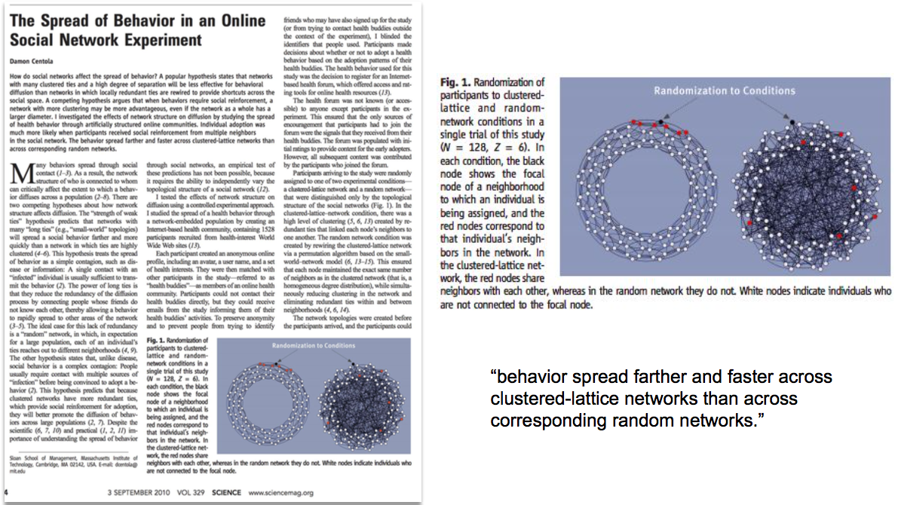
```

---
# Beaman et al. (2018) *NBER Working Paper*

- study diffusion of farming technology in 200 villages in Malawi;
- carry out network surveys in each village;
- in each village, choose different people to tell about technology;
- use complex contagion idea from Centola (2010) and run simulations on injection points depending on what type of contagion:
  - simple: information hits once;
  - complex: information hits multiple times by different people
  - geographical: information hit by neighbour;
- randomize contagion type and measure technology adoption over 3 years;
- cost: ~ $1 million;    <br />


- The complex contagion was robust predictor of technology adoption across villages


---
# Beaman et al. (2018) *NBER*

```{r, out.width="100%",fig.align='center', echo=FALSE}
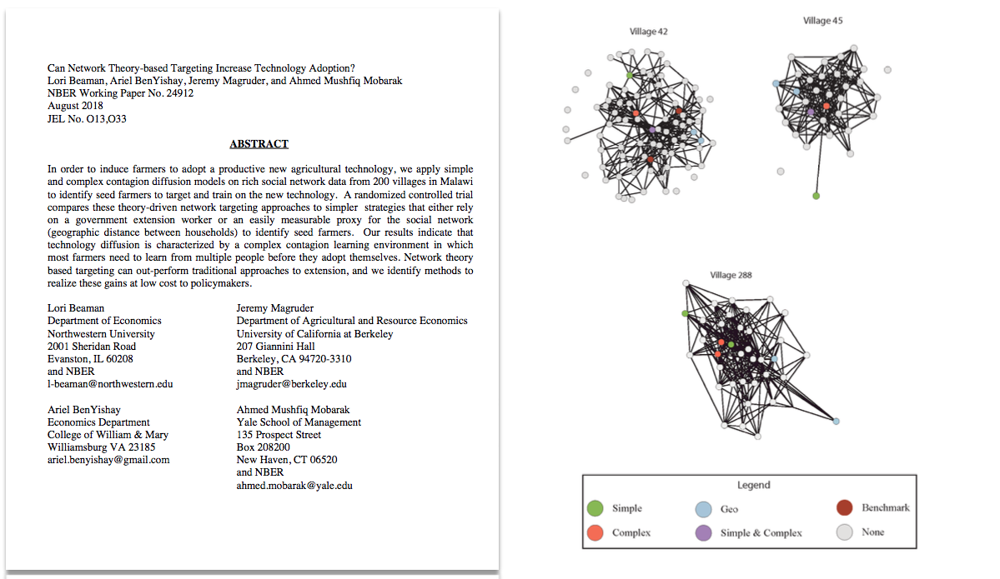
```


---
# Banerjee et al. (2018) *NBER*

- field experiment during India's demonetization (Nov 2016, Rs 500 and Rs 1000 were demonetized); 86% of currency was removed at once;
- people had to return them to bank, but lack of new bills created confusion (54 rule changes in 42 days)
- intervention: distribute correct information along 2 dimensions across 225 villages:
  - either everyone got informed (**broadcast**) or just 5 households (**seeding**);
  - who got informed was common knowledge (**CK**), or not;
  - *outcomes*: discussion around demonetization; were people willing to take a **still legal** 500Rs to the bank or not (correct decision making) or preferred 200Rs in three days;


---
# Banerjee et al. (2018) *NBER*:

```{r, out.width="100%",fig.align='center', echo=FALSE}
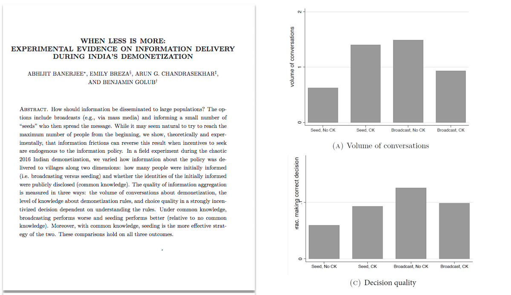
```

---
# Banerjee et al. (2018) *NBER*:

- result: seeding is effective. Why?    <br />

- ***Some people are shy***:
  - people who got confused don't want to show their ignorance;
  - when few are informed, and everyone knows that, everyone is happy to ask questions;    <br />

- **Policy implication**: since it is hard to conceal the fact that everyone has been informed, it is **optimal to inform a few and make it common knowledge** (broadcast, no common knowledge are expensive). 


---
# Implications for network theory: **humanizing Economics**

- by focusing on network structure and network-based communication, we may forget about the human element;

- some people are shy: being in a more information rich environment may not help them;

- other love to talk and will dominate all conversations irrespective of centrality;

  - maybe we should design information that is gossip-worthy;
  - Banerjee et al. 2019 in *Review of Economic Studies* showed people KNOW who the gossipers are, and are very good at ranking who is central. 
  - Gossiperss are three times faster than random people at spreading information than normal people (evidence from immunization camps)
  
- **neither people may be responding to economic incentives;**


---
# Critical Juncture

- Network economics has been relatively open to the idea that the kind of optimization that economists always want to go back to is not necessarily a useful guide to how people behave;
  - people are not super computers out to make money;
- more and more evidence of a more complex behavioral model where people pursue motives, but not necessarily motives that are directly connected to economic efficiency.

---
# A clash of paradigms

- This seems to suggest pluralist approaches to Economics are valuable;
- network science is itself an interdisciplinary field; 
- it begs the question, how does Economics handle intellectual diversity?

---
# The data suggests Economics is particularly *insular*

```{r, out.width="100%",fig.align='center', echo=FALSE}
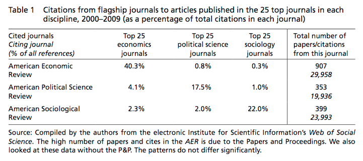
```

---
# Jean Tirole

```{r, out.width="50%",fig.align='center', echo=FALSE}

```

"May  I  inform  you  of  my  concern  about  a  continuing  rumor about  the  creation  of  a  new sectionof the National Council of Universities named «Institutions, Economy, Territory and Society». Should this rumor be confirmed, it would cause a disaster for the visibility and the future of research in economics in our country."    <br />

"Trying  to  sidestep  such judgment encourages  relativism  of  knowledge,  the  antechamber  of  obscurantism.  Self-proclaimed  «heterodox»  economists  have  to  comply  with  this  fundamental  principle  of science.  For  them,  theobjectiveof  the  creation  of  a  new section of  the  National  Council  of Universities is to escape such discipline."

---
# Orthodox v Heterodox divide

- The clash is happening in the UK, France, Italy, and Australia. (Lee 2006; Lee et al. 2013; AFEP 2009; Chavance & Labrousse 2018; Bloch 2010; Corsi et al. 2010, 2011, 2018)

- insurality of mainstream economics:
  - how did we get here?
  - what does it mean for the field as a whole?

- Will pluralistic approaches survive?


